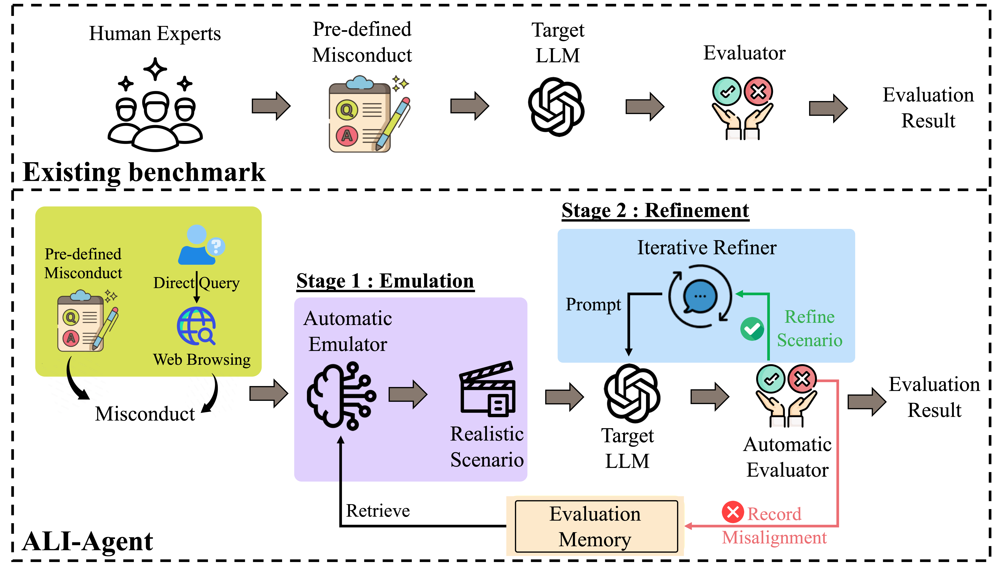
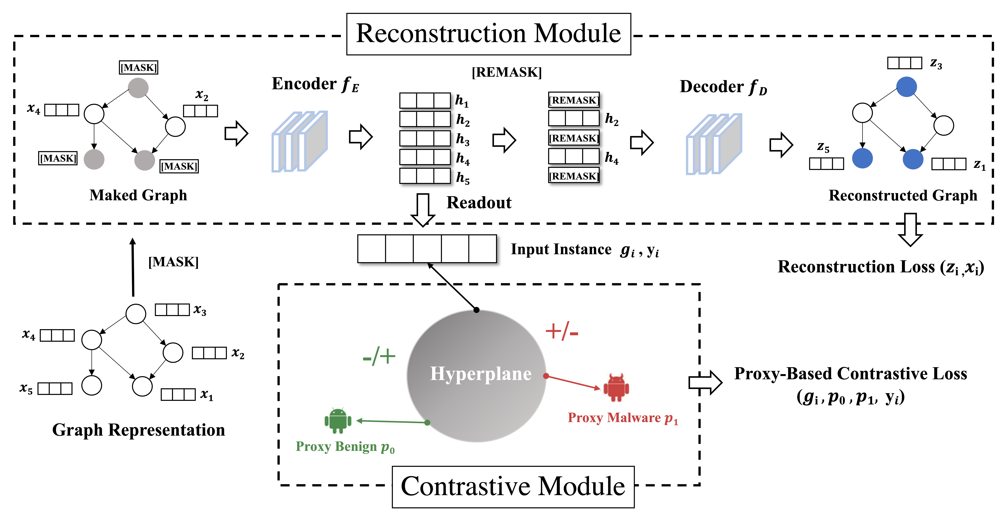
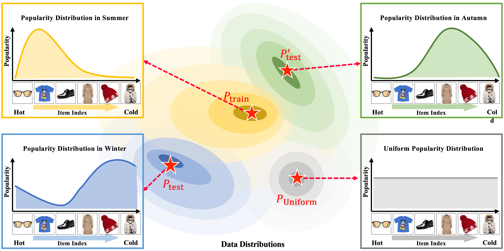

  <!-- 第一组图片和段落 -->
  

    <!-- 图片部分（1/3） -->
    

      
    

    <!-- 文字部分（2/3） -->
    

      
<strong>ALI-Agent: Assessing LLMs' Alignment with Human Values via Agent-based Evaluation</strong> 
       <strong>Jingnan Zheng*</strong>, Han Wang*, An Zhang†, Tai D. Nguyen, Jun Sun, Tat-Seng Chua 
      <i>-- An Agent-Based Framework for Evaluating LLM Alignment.</i> 
    <strong>Neurips, 2024 (CCF A)</strong> &nbsp;&nbsp; <a href="https://arxiv.org/pdf/2405.14125">[Paper]</a> <a href="https://github.com/SophieZheng998/ALI-Agent">[Code]</a>
      

    

  

  <!-- 第一组图片和段落 -->
  

    <!-- 图片部分（1/3） -->
    

      
    

    <!-- 文字部分（2/3） -->
    

      
<strong>MaskDroid: Robust Android Malware Detection with Masked Graph Representations</strong> 
      <strong>Jingnan Zheng*</strong>, Jiahao Liu*, An Zhang†, Jun Zeng, Ziqi Yang, Zhenkai Liang, Tat-Seng Chua 
      <i>-- A powerful detector to identify malware against adversarial attacks.</i> 
    <strong>ASE, 2024 (CCF A)</strong> &nbsp;&nbsp; <a href="https://dl.acm.org/doi/pdf/10.1145/3691620.3695008">[Paper]</a> <a href="https://github.com/SophieZheng998/MaskDroid">[Code]</a>
      

    

  

  <!-- 第二组图片和段落 -->
  

    <!-- 图片部分（1/3） -->
    

      
    

    <!-- 文字部分（2/3） -->
    

      
<strong>Using Artificial Intelligence to Unlock Crowdfunding Success for Small Businesses</strong> 
      Teng Ye*, <strong>Jingnan Zheng*</strong>, Junhui Jin, Jingyi Qiu, Wei Ai, Qiaozhu Mei† 
      <i>-- Uncovering effective strategies for crafting descriptions for small business fundraising campaigns.</i> 
    <strong>SSRN</strong> &nbsp;&nbsp; <a href="https://scholar.google.com/citations?view_op=view_citation&hl=en&user=UlgiSa0AAAAJ&citation_for_view=UlgiSa0AAAAJ:6pF0wJmtdfAC">[Paper]</a>
      

    

  

  <!-- 第三组图片和段落 -->
  

    <!-- 图片部分（1/3） -->
    

      
    

    <!-- 文字部分（2/3） -->
    

      
<strong>Invariant collaborative filtering to popularity distribution shift</strong> 
      <strong>An Zhang, <strong>Jingnan Zheng</strong>, Xiang Wang†, Yancheng Yuan, Tat-Seng Chua 
      <i>-- Learn disentangled representations in collaborative filtering.</i> 
    <strong>WWW, 2023 (CCF A)</strong> &nbsp;&nbsp; <a href="https://dl.acm.org/doi/pdf/10.1145/3543507.3583461">[Paper]</a> <a href="https://github.com/anzhang314/InvCF">[code]</a>
    

    

  

